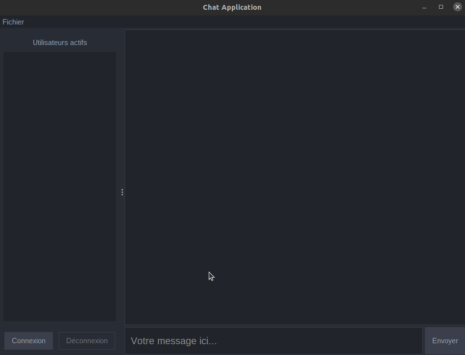
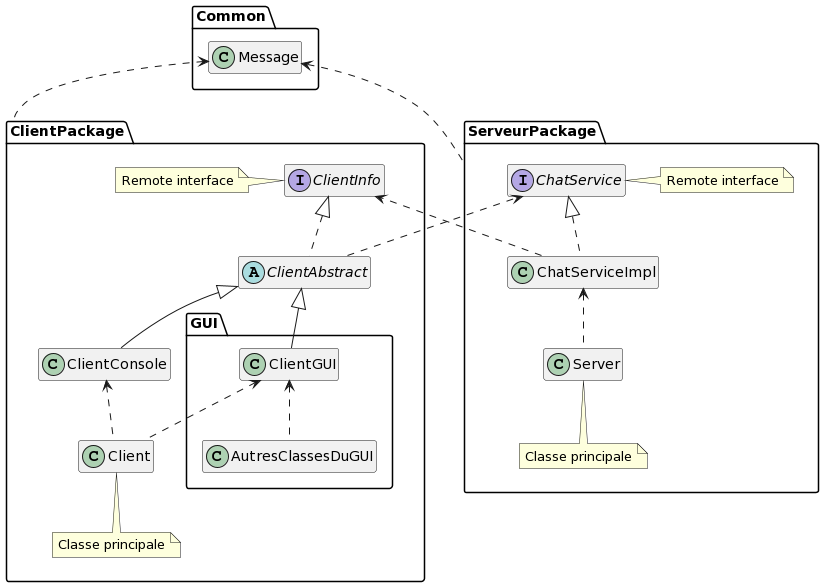

<div align="center">
	<br>
	<br>
	
	<h1>Simple RMI Chat</h1>
	<p>
	<h2>A simple centralized chat application based on RMI.</h2>
	</p>
	<br>
</div>


## Showcase
<br>

<p style="text-align: center">
  
</p>

## Description

Here is an implementation of a server/client chat model based on RMI. It is a purely centralized chat application.

## Features

- List of users currently logged in.
  
- Login/logout system.
  
- Persistent conversation history.
  
- User-friendly interface made with Swing 😄.

## Architecture

<br>

<p style="text-align: center">
  
</p>

> - ### Client
>   - The client represents a user of the chat application, it uses the ClientInfo interface to communicate with the server. The directory also contains the implementation of the graphical interface of the client application.

> - ### Server
>   - The server acts as an intermediary so that the clients can communicate with each other. It initializes the remote ChatService used by the client to communicate with the rest of the network.

> - ### Common
>   - Contains the Message class representing a network message and MyLogManager to display log messages.

> - ### Remote interfaces
>   - Represents and contains all used remote interfaces.


## Instructions

<br>

1. Compile the source code with the following command:
   
   ```console
      make clean
      make
   ```
2. Open a new console and use the following command to launch the server:
   ```console
      make launch-server
   ```
3. Open a new console and use the following command to launch a client:
   ```console
      make launch-client
   ```